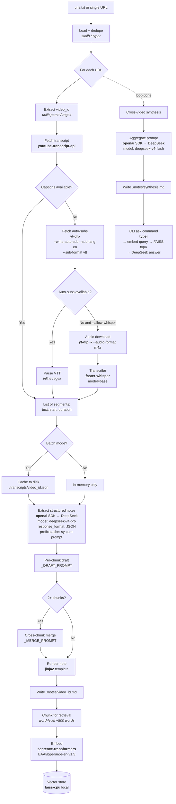

# yt-ingest architecture

This document describes the project as it is **today**. Historical decisions
and rejected alternatives live in the ADR set at `docs/adr/` — in particular
the meta-decision at `docs/adr/0000-record-architecture-decisions.md`. The
original superpowers spec has been removed; the ADRs and this file are the
current source of truth.

---

## 1. Purpose

`yt-ingest` is a CLI tool that turns a list of YouTube URLs into a small
local knowledge base: cached transcripts, per-video study notes produced by
an LLM, a FAISS vector index over the notes, and a cross-video synthesis. It
runs on a single user's workstation, talks to the DeepSeek API for LLM work,
and stores everything on the local filesystem.

---

## 2. Pipeline flow



Current model wiring (verified against `src/yt_ingest/llm.py` and
`src/yt_ingest/synthesize.py`):

- Default model for `chat_json()`: `deepseek-v4-pro` — used for draft, merge,
  and `ask`.
- Synthesis overrides the default with `model="deepseek-v4-flash"`.
- Synthesis output is written to `notes/synthesis.md` (not `_index.md`).

---

## 3. Library choices

| Concern | Library | Why |
|---|---|---|
| Transcript primary | `youtube-transcript-api` | No auth, returns timestamped segments directly. |
| Transcript fallback | `yt-dlp` (VTT auto-subs) | Aggressively maintained; survives YouTube endpoint churn. |
| VTT parsing | Inline regex (current impl) | `webvtt-py` is declared as a dependency but the current `YtDlpFetcher` uses an inline parser; cleanup candidate. |
| Audio-only transcript fallback | `faster-whisper` (CTranslate2 backend) | Fits in workstation VRAM; gated behind `--allow-whisper` because it is slow. |
| Video metadata | `yt-dlp --dump-json` | Title, channel, duration; same path regardless of transcript source. |
| LLM extraction + synthesis + ask | `openai` SDK with `base_url=https://api.deepseek.com` | DeepSeek is OpenAI-API-compatible; no separate SDK. |
| Token-aware chunking (transcript → drafts) | `tiktoken`, `cl100k_base` encoding | Local, fast, no network call; a reasonable proxy for DeepSeek's BPE. |
| Schema and config models | `pydantic` v2 | Runtime validation of transcript cache, video metadata, etc. |
| Note template | `jinja2` | Envelope around model output (title, channel, duration, id, URL, body). |
| CLI | `typer` | Type-hint driven, less boilerplate than `click`. |
| Pretty output | `rich` | Progress spinners, colour, stderr console. |
| Env loading | `python-dotenv` | `.env` for `DEEPSEEK_API_KEY`. |
| YAML (declared) | `pyyaml` | Declared dependency; not imported in current source. |
| Embeddings | `sentence-transformers` + `BAAI/bge-large-en-v1.5` | Local, open-weight, reuses the already-loaded GPU. |
| Vector store | `faiss-cpu` | Adequate for <10k chunks; no service to run. |
| Text splitting for retrieval | Word-level custom splitter | `langchain-text-splitters` is declared as a dependency but the current `retrieval.py` uses a simple ~500-word splitter; cleanup candidate. |

---

## 4. Data contracts

### 4.1 Cached transcript — `transcripts/{video_id}.json`

Pydantic model: `yt_ingest.models.TranscriptCache`.

```json
{
  "video_id": "dQw4w9WgXcQ",
  "url": "https://www.youtube.com/watch?v=dQw4w9WgXcQ",
  "source": "youtube_transcript_api",
  "fetched_at": "2026-06-08T10:00:00Z",
  "title": "...",
  "channel": "...",
  "duration_seconds": 1234,
  "segments": [
    {"text": "...", "start": 0.0, "duration": 3.5}
  ]
}
```

`source` is one of `youtube_transcript_api | ytdlp_subs | whisper`. The
`title`, `channel`, and `duration_seconds` fields are fetched at fetch time
via `yt-dlp --dump-json` and stored alongside the segments.

### 4.2 Per-video note — `notes/{video_id}.md`

Rendered by `src/yt_ingest/templates/note.md.j2`. Current template:

```markdown
# {{ title }}

**Channel:** {{ channel }} | **Duration:** {{ duration }} | **Source:** {{ source }}
**Video ID:** `{{ video_id }}` | **URL:** {{ url }}

---

{{ blog_post }}
```

This is a Jinja envelope around the model's output. There is **no YAML
frontmatter** in the current template and **no fixed body section list** —
the body is whatever the model produced under the `blog_post` JSON key
(label only, not a contract; see ADR-0006). Clickable YouTube deep-link
timestamps are **not** rendered by this template.

### 4.3 Cross-video synthesis — `notes/synthesis.md`

Produced by `yt_ingest.synthesize.synthesize_notes()`, using
`deepseek-v4-flash` and written to `notes/synthesis.md`. The prompt requests
this JSON shape:

```json
{
  "cross_cutting_themes": ["..."],
  "contradictions": [{"topic": "...", "views": ["..."]}],
  "complementary_ideas": ["..."],
  "synthesis": "5-8 sentence synthesis",
  "recommended_watch_order": ["video_id", "..."],
  "further_questions": ["..."]
}
```

The rendering code walks these fields in a fixed order and emits a Markdown
file with headings:

1. `## Synthesis`
2. `## Cross-Cutting Themes`
3. `## Contradictions`
4. `## Complementary Ideas`
5. `## Recommended Watch Order`
6. `## Further Questions`

Empty fields are skipped. The synthesis only reads notes whose file stem is
not `_index` or similar; it globs `*.md` and slices each preview to the first
3000 characters.

### 4.4 Vector index — `.faiss_index/`

Two files, written by `yt_ingest.retrieval.build_index()`:

- `index.faiss` — the FAISS index (`IndexFlatIP`).
- `meta.json` — `[{"video_id", "note_path", "text"}, ...]` in chunk order.

---

## 5. CLI surface

Six subcommands under the `yt-ingest` entry point (defined via
`[project.scripts]` in `pyproject.toml`, pointing at
`yt_ingest.cli.app`):

| Command | Arguments / options | Effect |
|---------|---------------------|--------|
| `yt-ingest fetch` | `[URL]` positional; `--file PATH`; `--allow-whisper`; `--agent` (no-op); `--output PATH` | Fetch transcripts. Batch (`--file`) caches to disk; single-URL prints to stdout or writes `--output`. |
| `yt-ingest extract` | _(none)_ | Reads `transcripts/*.json`, writes `notes/<id>.md` plus `.notes/<id>.sha` checksum. Idempotent. |
| `yt-ingest index` | _(none)_ | Builds FAISS index from `notes/*.md` into `.faiss_index/`. |
| `yt-ingest synthesize` | _(none)_ | Writes `notes/synthesis.md` and `.notes/.synthesis.sha`. Idempotent. |
| `yt-ingest ask QUESTION` | `QUESTION` positional | Embeds the query, retrieves top-5 chunks, asks DeepSeek, prints the answer. |
| `yt-ingest run` | `[URL]` positional; `--file PATH`; `--allow-whisper`; `--agent`; `--output PATH` | Full pipeline (batch) or single-URL (note by default; raw transcript when `--agent`). |

Modes and flags interact per ADR-0007. `--file` and a positional URL are
mutually exclusive. `--agent` is meaningful only on `run`.

---

## 6. Credentials

Only one credential is required.

| Env var | Required | Purpose |
|---|---|---|
| `DEEPSEEK_API_KEY` | **Yes** | All LLM calls (extraction, synthesis, ask) go through `openai.OpenAI(base_url="https://api.deepseek.com")`. |
| `HF_HOME` | Optional | Override HuggingFace cache location for embedding and Whisper models. |

No YouTube Data API key, no Google OAuth, no Voyage/remote-embedding key.
Loaded via `python-dotenv` from `.env`. `.env.example` is shipped; `.env` is
in `.gitignore`.

---

## 7. Project layout

```
yt-ingest/
├── README.md
├── CONTEXT.md                      # glossary
├── pyproject.toml
├── .env.example
├── .gitignore
├── urls.txt                        # example input
├── docs/
│   ├── adr/                        # this ADR set
│   └── architecture.md             # this file
├── src/yt_ingest/
│   ├── __init__.py
│   ├── cli.py                      # typer entrypoint
│   ├── config.py                   # env + paths via dotenv
│   ├── models.py                   # pydantic schemas
│   ├── utils.py                    # URL parsing, checksums, yt-dlp meta
│   ├── llm.py                      # DeepSeek wrapper + CacheStats
│   ├── extract.py                  # draft + merge prompts, render_note
│   ├── synthesize.py               # cross-video synthesis
│   ├── retrieval.py                # FAISS build + search
│   ├── fetchers/
│   │   ├── __init__.py
│   │   ├── base.py                 # Protocol + chain runner
│   │   ├── youtube_api.py
│   │   ├── ytdlp.py
│   │   └── whisper.py
│   └── templates/
│       └── note.md.j2              # Jinja envelope
├── tests/                          # pytest suite, no real network calls
├── transcripts/                    # gitignored cache
├── notes/                          # gitignored output
└── .faiss_index/                   # gitignored
```

`transcripts/`, `notes/`, and `.faiss_index/` are gitignored runtime output
directories.

---

## 8. Operational notes

**YouTube IP blocking is real.** When `youtube-transcript-api` starts
returning `IpBlocked` or `TranscriptsDisabled` for videos that obviously
have captions, the cause is usually the requesting IP, not the code. The
fetcher chain runs requests **sequentially**, not in parallel — parallelism
triggers YouTube's threshold. Users hitting this will typically succeed by
switching networks, waiting, or letting the chain fall through to the
`yt-dlp` tier, which uses a more permissive endpoint. Exponential backoff
is not implemented inside the fetchers today; the mitigation is the chain
design itself plus sequential execution.

**Prompt caching.** DeepSeek caches request prefixes server-side. The
extraction system prompt (`_DRAFT_PROMPT`) is byte-identical across every
video, so from the second video onwards it is a cache hit. The `CacheStats`
dataclass in `src/yt_ingest/llm.py` surfaces the split per call
(`hit_tokens`, `miss_tokens`), and the CLI logs both numbers next to each
OK / completion line. **Cache-hit tokens are billed at ~10% of the regular
input price**, so any cost estimate based on total `prompt_tokens` alone
will overstate by roughly an order of magnitude on a long batch run.

**Token accounting.** `chat_json` returns a `CacheStats` alongside the
parsed JSON. Callers (`extract.extract_from_cache`, `synthesize.synthesize_notes`,
`cli.ask`) merge stats across multiple calls and report them on the CLI.
There is currently no end-of-run cost estimate printed to stderr; cost
calculation is left to the user.

**Test discipline.** The test suite makes **no real network calls**. YouTube
and DeepSeek interactions are mocked:

- `pytest-mock` patches `openai.OpenAI` for the LLM tests.
- Fetchers are tested by patching the underlying libraries
  (`youtube_transcript_api`, `subprocess.run` for `yt-dlp`).
- Fixtures live in `tests/fixtures/` (canned transcript JSON, VTT text).

Run with `pytest`. Type checking is `mypy --strict src` (note: the current
`cli.py` single-URL path carries a couple of `str | None` / `str` narrowings
that are a pre-existing cleanup candidate, not an architectural issue).

---

## 9. Cross-reference

Historical decisions are in the ADR set at `docs/adr/`:

- `docs/adr/0000-record-architecture-decisions.md` — the ADR discipline.
- `docs/adr/0001-transcript-fetching-chain-of-responsibility.md` — fetcher tiers.
- `docs/adr/0002-deepseek-as-llm-provider.md` — provider and model policies.
- `docs/adr/0003-local-first-vector-retrieval.md` — FAISS + local embedder.
- `docs/adr/0004-cli-only-architectural-boundary.md` — what the tool is not.
- `docs/adr/0005-study-note-as-primary-output-contract.md` — note shape.
- `docs/adr/0006-rule-driven-prompts-over-few-shot.md` — prompt strategy.
- `docs/adr/0007-cli-invocation-modes.md` — batch / single-URL / agent faces.

The ADRs capture **why**; this file captures **what**. The original
superpowers specs (`docs/superpowers/specs/` and `docs/superpowers/plans/`)
have been removed as part of this migration.
