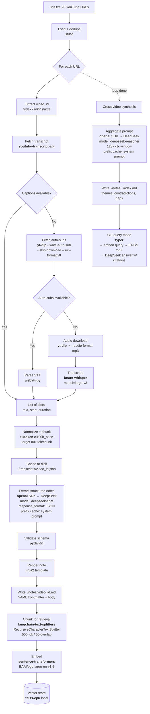

# YouTube Ingestion Pipeline — `yt-ingest`

## Goal

Ingest a list of YouTube URLs, extract structured notes via the DeepSeek API, and build a locally queryable knowledge base. Optimised for a single user processing ~20 videos at a time on a workstation with an NVIDIA GPU available for fallback transcription. The deliverable is a CLI tool — no web UI, no multi-user, no cloud deploy.

## Non-goals

- ❌ Web UI, REST API, or any HTTP server
- ❌ Docker / Compose / Kubernetes manifests
- ❌ Multi-user authentication, accounts, or RBAC
- ❌ Cloud deployment scripts (no Terraform, no Helm)
- ❌ Real-time / streaming ingestion — batch only
- ❌ Support for non-YouTube video sources in v1
- ❌ Translation between languages — pass-through only

If a feature is not listed in **Acceptance criteria** below, do not build it. Ask first.

## Architecture



## Library choices

| Concern | Library | Why |
|---|---|---|
| Transcript primary | `youtube-transcript-api` | No auth, returns timestamped dicts directly |
| Transcript fallback | `yt-dlp` | Aggressively maintained; survives YouTube changes |
| VTT parsing | `webvtt-py` | Stdlib alternative is painful |
| Audio fallback transcription | `faster-whisper` (CTranslate2 backend) | 4× faster than `openai-whisper`, fits `large-v3` in 16GB VRAM |
| LLM extraction + synthesis | `openai` SDK (`base_url=https://api.deepseek.com`) | DeepSeek is OpenAI-API-compatible; no separate SDK needed |
| Token counting for chunking | `tiktoken` (`cl100k_base`) | Good proxy for DeepSeek BPE; no network call |
| Schema validation | `pydantic` v2 | — |
| Templating | `jinja2` | — |
| CLI | `typer` | Type-hint driven, less boilerplate than `click` |
| Embeddings | `sentence-transformers` + `BAAI/bge-large-en-v1.5` | Local, free, runs on the same GPU as Whisper |
| Vector store | `faiss-cpu` | Overkill-but-fine for <10k chunks; no service to run |
| Text splitting | `langchain-text-splitters` | Recursive splitter handles markdown well |
| Env loading | `python-dotenv` | — |

**Pluggability requirement:** `TranscriptFetcher` must be a `typing.Protocol` with three concrete implementations (`YouTubeTranscriptApiFetcher`, `YtDlpFetcher`, `WhisperFetcher`) wired together by a chain-of-responsibility runner. When YouTube breaks one, the next takes over.

## Credentials

Only one credential is mandatory.

| Env var | Required | Purpose |
|---|---|---|
| `DEEPSEEK_API_KEY` | ✅ Yes | Extraction + synthesis via DeepSeek API |
| `HF_HOME` | Optional | Override HuggingFace cache location for embedding/whisper models |

No YouTube Data API key. No Google OAuth. No Voyage key (using local embeddings).

Load via `python-dotenv` from `.env`. Ship `.env.example` with placeholder values. `.env` must be gitignored.

## Project layout

```
yt-workflow/                     # repo root (pwd)
├── SPEC.md                      # this file
├── README.md                    # user-facing quickstart
├── pyproject.toml
├── .env.example
├── .gitignore
├── urls.txt                     # input
├── src/yt_ingest/
│   ├── __init__.py
│   ├── cli.py                   # typer entrypoint
│   ├── config.py                # env + paths
│   ├── models.py                # pydantic schemas
│   ├── fetchers/
│   │   ├── __init__.py
│   │   ├── base.py              # TranscriptFetcher Protocol + runner
│   │   ├── youtube_api.py
│   │   ├── ytdlp.py
│   │   └── whisper.py
│   ├── extract.py               # DeepSeek structured extraction
│   ├── synthesize.py            # cross-video pass
│   ├── retrieval.py             # FAISS index + embedding
│   ├── llm.py                   # DeepSeek wrapper (retries, cache logging, token accounting)
│   ├── templates/
│   │   └── note.md.j2
│   └── utils.py
├── tests/
│   ├── conftest.py
│   ├── fixtures/                # canned transcripts, mock responses
│   ├── test_fetchers.py
│   ├── test_extract.py
│   └── test_retrieval.py
├── transcripts/                 # gitignored, cache
├── notes/                       # gitignored, output
└── .faiss_index/                # gitignored
```

## CLI surface

```bash
yt-ingest fetch urls.txt              # populate ./transcripts/
yt-ingest extract                     # transcripts/ → notes/
yt-ingest index                       # notes/ → FAISS
yt-ingest synthesize                  # notes/ → notes/_index.md
yt-ingest ask "question..."           # retrieval + Claude answer
yt-ingest run urls.txt                # fetch → extract → index → synthesize, all in one
```

Each subcommand must be idempotent and resumable — re-running skips work already done. Determine "done" by file existence + checksum of inputs, not timestamps.

## Data contracts

### Cached transcript (`./transcripts/{video_id}.json`)

```json
{
  "video_id": "dQw4w9WgXcQ",
  "url": "https://www.youtube.com/watch?v=dQw4w9WgXcQ",
  "source": "youtube_transcript_api",
  "fetched_at": "2026-05-17T10:00:00Z",
  "segments": [
    {"text": "...", "start": 0.0, "duration": 3.5}
  ]
}
```

`source` must be one of `youtube_transcript_api | ytdlp_subs | whisper`.

### Extracted note (`./notes/{video_id}.md`)

YAML frontmatter + markdown body. Frontmatter fields:

```yaml
---
video_id: dQw4w9WgXcQ
url: https://www.youtube.com/watch?v=dQw4w9WgXcQ
title: "..."
channel: "..."
duration_seconds: 1234
transcript_source: youtube_transcript_api
extracted_at: 2026-05-17T10:00:00Z
model: deepseek-chat
---
```

`title`, `channel`, and `duration_seconds` are fetched via `yt-dlp --dump-json` at fetch time and stored in the transcript cache alongside segments.

Body sections (in this order):

1. `## Summary` — 3–5 sentences
2. `## Key claims` — bulleted, each with a `[mm:ss]` timestamp citation
3. `## Frameworks & mental models` — bulleted
4. `## Definitions` — term: definition pairs
5. `## Worth rewatching` — `[mm:ss]` + reason
6. `## Counterpoints & caveats` — author's stated limitations or things you noticed
7. `## Open questions` — what the video raises but doesn't answer

### Synthesis index (`./notes/_index.md`)

Cross-video MOC with sections: `## Recurring themes`, `## Contradictions between sources`, `## Gaps / unanswered questions`, `## Suggested reading order`. Every claim must link back to source notes via `[[video_id]]` wiki-links.

## Acceptance criteria

Tick these as you complete commits. They are the definition of done.

- [ ] `python -m yt_ingest fetch urls.txt` populates `./transcripts/*.json` for all URLs that have any transcript source available
- [ ] Re-running `fetch` is idempotent (cached transcripts are skipped, logged as `SKIP`)
- [ ] Fetcher chain falls through in order: API → yt-dlp subs → Whisper, with a clear log line per attempt
- [ ] Whisper fallback only runs when `--allow-whisper` flag is passed (it's slow and expensive)
- [ ] `python -m yt_ingest extract` produces `./notes/{video_id}.md` with all required frontmatter fields and all 7 body sections
- [ ] Timestamps in notes are clickable YouTube deep links: `[mm:ss](https://youtu.be/{id}?t={seconds})`
- [ ] `python -m yt_ingest index` builds a FAISS index at `./.faiss_index/`
- [ ] `python -m yt_ingest synthesize` produces `./notes/_index.md` referencing every note
- [ ] `python -m yt_ingest ask "..."` returns an answer with inline `[video_id mm:ss]` citations
- [ ] `python -m yt_ingest run urls.txt` chains all steps end-to-end
- [ ] All DeepSeek calls go through `llm.py` wrapper that handles retries (exponential backoff, max 3), logs token usage, and reports `prompt_cache_hit_tokens` vs `prompt_cache_miss_tokens`
- [ ] `.env.example` exists; real `.env` is in `.gitignore`
- [ ] `pytest` passes with no real network calls (mock DeepSeek/openai client, mock youtube-transcript-api)
- [ ] `ruff check src tests` passes
- [ ] `mypy --strict src` passes
- [ ] `README.md` documents: install, env setup, the 5 CLI commands, and the fallback chain

## Operational notes

- **YouTube IP blocking is real.** If `youtube-transcript-api` starts returning `IpBlocked` or `TranscriptsDisabled` for videos that obviously have captions, it's the IP not the code. Implement exponential backoff (1s, 4s, 16s) and run requests sequentially, not in parallel. Document this in the README troubleshooting section.
- **DeepSeek model selection.** Use `deepseek-chat` (V3) for per-video extraction — cheap, fast, 128k context. Use `deepseek-reasoner` (R1) only for the synthesis pass where cross-document reasoning matters.
- **Prompt caching.** DeepSeek automatically caches request prefixes (disk cache). The system prompt used for extraction is identical across all videos — it will be a cache hit from the second video onward. The `llm.py` wrapper must read `usage.prompt_cache_hit_tokens` and `usage.prompt_cache_miss_tokens` from each response and log them. Cache hit tokens are billed at ~10% of regular input price, so log the split to make cost estimates accurate.
- **Token accounting.** `llm.py` logs `input_tokens`, `output_tokens`, cache hit/miss tokens, and a running total per session. At the end of a `run`, print a cost estimate to stderr using DeepSeek's published rates.
- **Determinism in tests.** All fixtures live in `tests/fixtures/`. Never call out to YouTube or DeepSeek in tests. Use `pytest-mock` to patch the `openai.OpenAI` client.

## Suggested commit plan

1. Scaffolding: `pyproject.toml`, package layout, `.env.example`, empty CLI
2. `config.py` + `models.py` (pydantic schemas matching the data contracts above)
3. `TranscriptFetcher` Protocol + `YouTubeTranscriptApiFetcher` + tests
4. `YtDlpFetcher` + tests
5. `WhisperFetcher` (gated behind flag) + tests
6. Chain runner + `fetch` CLI command + integration test
7. `llm.py` DeepSeek wrapper (retries, token logging, cache hit reporting)
8. `extract` command + jinja template + tests
9. Embedding + FAISS `index` command + tests
10. `synthesize` command + tests
11. `ask` command (retrieval + answer with citations) + tests
12. `run` orchestrator + README
